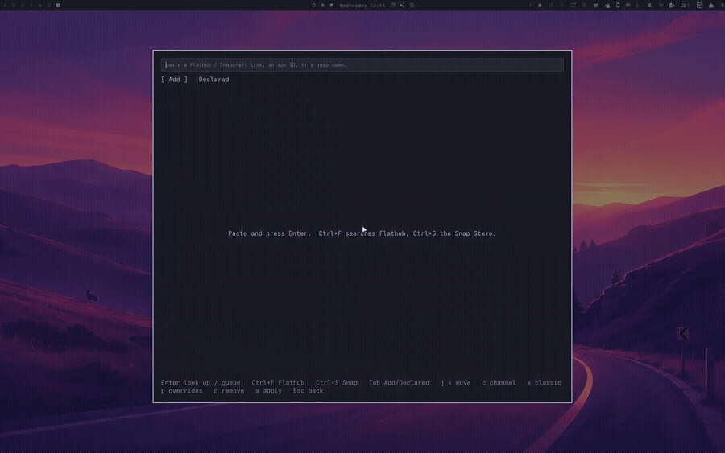
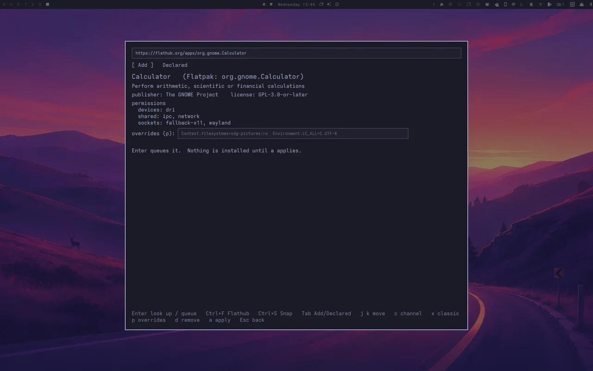
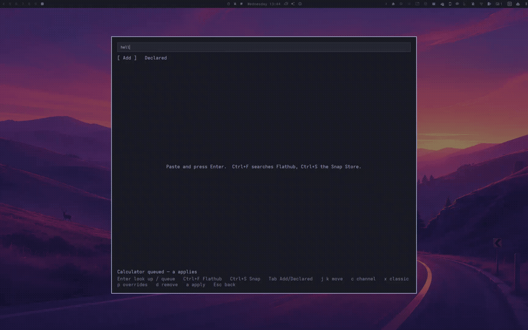
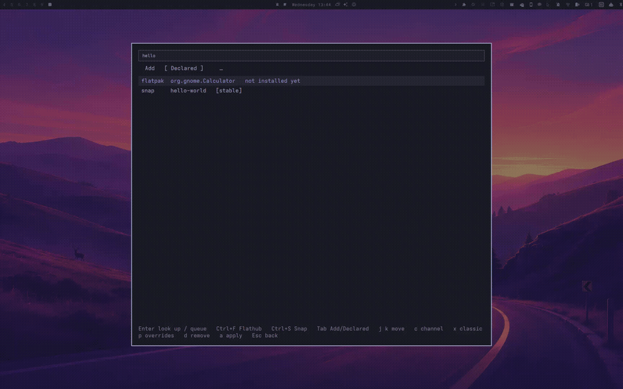
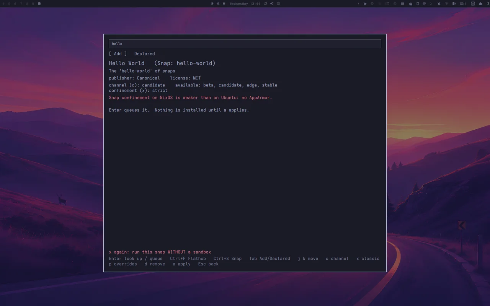
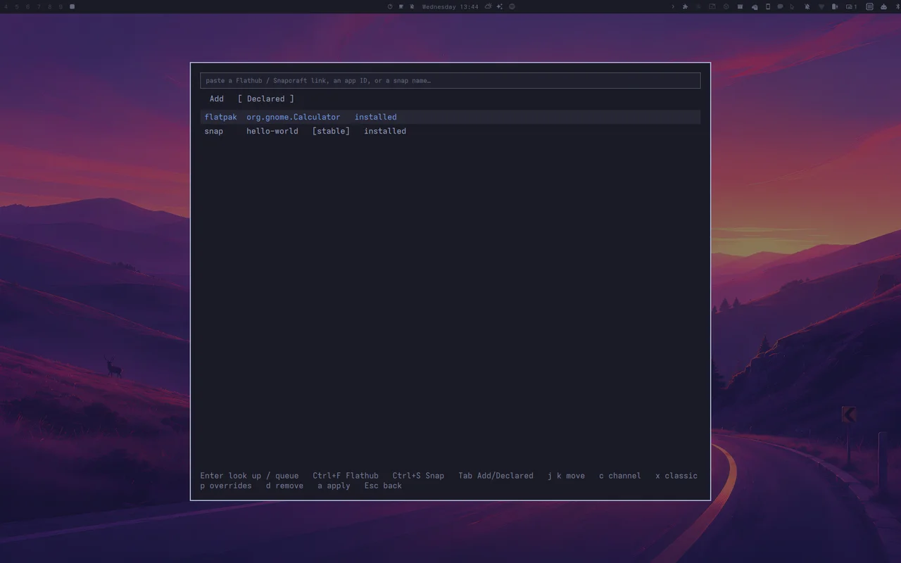
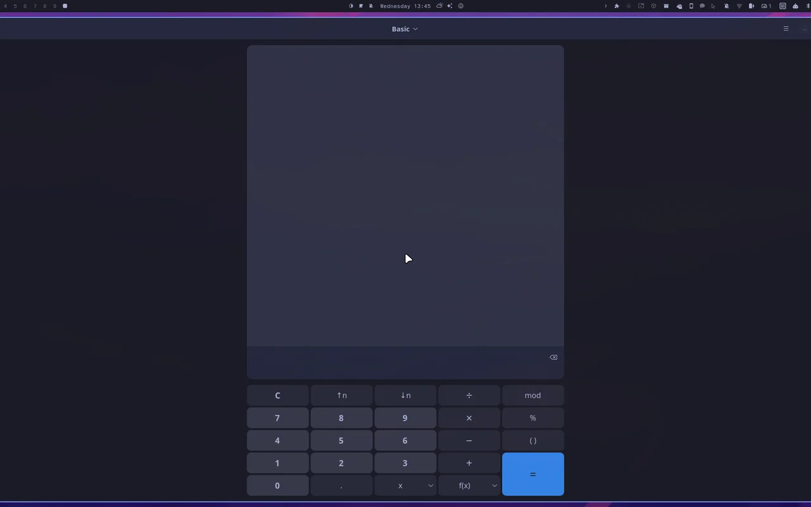
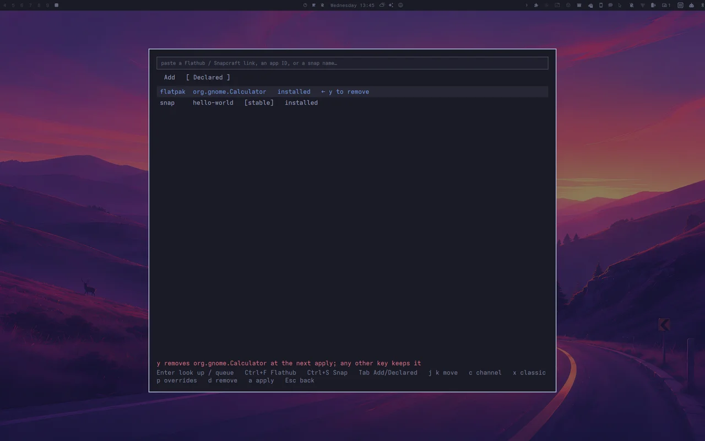

Some software is only current as a **Flatpak** or a **Snap**. Paste the link,
see what the app can reach, queue it, and apply. It ends up in your NixOS
configuration, not in a terminal's scrollback.

<ul class="links">
  <li><a href="https://github.com/olafkfreund/nixarchy-flatsnap#install">Install</a></li>
  <li><a href="https://github.com/olafkfreund/nixarchy-flatsnap#keys">Keys</a></li>
  <li><a href="https://github.com/olafkfreund/nixarchy-flatsnap">Source</a></li>
</ul>

<h2>From a link to an installed app</h2>

Open the Omarchy menu, then <em>Install → Flatpak &amp; Snap</em>. Everything
after that is keyboard.

<section class="scene">
  
  

    
1 · Paste

    <h3>Whatever you have in hand</h3>
    
A Flathub or Snapcraft page, a <code>.flatpakref</code>, an app ID like
    <code>com.spotify.Client</code>, a bare name like <code>spotify</code>,
    or the <code>flatpak install …</code> / <code>snap install …</code> line
    from a project's README. That last one is read, and never run. No link?
    <code>Ctrl+F</code> searches Flathub, <code>Ctrl+S</code> the Snap Store.

  

</section>

<section class="scene">
  
  

    
2 · Look

    <h3>Before anything is queued</h3>
    
The card shows the publisher and license. For a Flatpak it lists the
    sandbox permissions, and for a Snap the confinement.
    Snaps get a channel (<code>c</code>). Classic confinement takes two
    presses of <code>x</code> and is marked in red, because it means no sandbox.

  

</section>

<section class="scene">
  
  

    
3 · Queue, then apply

    <h3>A line in a Nix file, then a rebuild</h3>
    
<code>Enter</code> writes the app into
    <code>~/.config/nixarchy/flatsnap.nix</code>. <code>a</code> runs
    <code>nixarchy-apply</code> and streams the build into the panel. Flatpaks
    become <code>services.flatpak.packages</code>. Snaps are kept installed by
    a small reconciler on top of
    <a href="https://github.com/nix-community/nix-snapd">nix-snapd</a>.
    Un-declaring with <code>d</code> <code>y</code> and applying removes the
    app again.

  

</section>

  <figure>
    <figcaption>Classic confinement takes a second <code>x</code>.</figcaption></figure>
  <figure>
    <figcaption>After apply: both installed.</figcaption></figure>
  <figure>
    <figcaption>And it runs.</figcaption></figure>

<section class="scene">
  
  

    
4 · Take it away again

    <h3>Un-declare, then apply</h3>
    
<code>d</code> marks the row, <code>y</code> confirms, and any other key
    keeps it. The next <code>a</code> removes what nixarchy installed. A Snap
    you installed yourself is never touched.

    
<a href="img/11-removed.webp">The removal's apply</a>, as the panel shows it.

  

</section>

<h2>What it will not do</h2>

These are deliberate.

<section class="scene scene--text">
  

    <ul>
      <li><strong>Run what you paste.</strong> Input is refused unless it
      matches the Flatpak or Snap ID grammar. That covers other hosts,
      <code>http://</code>, non-Flathub remotes and flags it doesn't know.</li>
      <li><strong>Remove software you installed yourself.</strong> The
      reconciler removes only Snaps it installed. Flatpaks follow nixarchy's
      <code>uninstallUnmanaged</code>, and when that is on the panel names
      what would go and asks twice.</li>
      <li><strong>Pretend Snaps are sandboxed like on Ubuntu.</strong> nix-snapd
      has no AppArmor, and the panel says so on every Snap. snapd runs only
      while you have a Snap declared.</li>
      <li><strong>Build behind your back.</strong> Queuing edits a file. Only
      <code>a</code> rebuilds.</li>
    </ul>
  

</section>

MIT · part of the <a href="https://olafkfreund.github.io/nixarchy/">nixarchy</a> family

